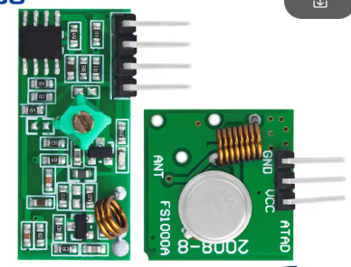
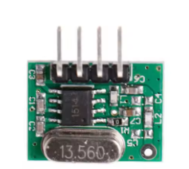

# ESP32/8266 MQTT to RF 433MHz Bridge (with Pulse Stretch)

This project acts as a bridge between **Home Assistant (via MQTT)** and **433MHz RF devices** (fans, switches). In particular, it is used with ceiling fans/lights sold in Israel under the brand name **"Pacific"**, but it will likely work with other generic RF 433MHz controls.

## 🚀 Why this project?
I needed to control ceiling fans and lights in 4 rooms. An ESP + RF transmitter is a very cost-effective solution.
* **The Solution:** This project uses a modified version of the `RCSwitch` library (included) that implements a **"Stretch"** feature.
* **How it works:** It stretches the pulse train if needed. The user must test and set this for each code in the `NEEDS_F` table (see below).

## 📂 Project Structure

This repository contains two separate tools:

1.  **`CodeLearner/`**: A standalone tool to **read** and decode signals from your existing remotes. Use this first to find your codes.
2.  **`FanRemoteBridge/`**: The main application. It connects to WiFi/MQTT and transmits the codes you recorded.

## 🛠️ Hardware Required & Recommendations

* **ESP32** or **ESP8266** (NodeMCU, Wemos D1 Mini). 
    * *Note: The **ESP-01** is a great choice (small and low cost) for the final deployed device after development is done.*
* **433MHz Receiver** (for learning codes) - Connect Data to **Pin 16** (default, use any available GPIO).
* **433MHz Transmitter** (for controlling fans) - Connect Data to **Pin 3** (default, same).

### ⚠️ Critical Hardware Tips
1.  **Voltage Warning:** Power both the Receiver and Transmitter with **3.3V**. Connecting them to 5V can damage the GPIO pins on your ESP32/8266.
2.  **Transmitter Selection:** * **Highly Recommended:** Use a **Crystal Oscillator Transmitter** (see image below). The cheaper/standard transmitters tend to drift in frequency as they warm up (especially inside a case), causing the signal to fail.
    * The basic ones (FS1000A) are okay for testing but often not reliable for long-term use.

| **Standard Kit (Drift prone)** | **Recommended Crystal TX (Stable)** |
| :---: | :---: |
|  |  |
| *Okay for learning codes* | *Best for the final bridge* |

## ⚙️ Installation & Setup

### 1. Configure Network
Navigate to the `FanRemoteBridge` folder.
1.  Rename `network_config_example.h` to `network_config.h`.
2.  Open it and enter your Wi-Fi SSID, Password, and MQTT Broker IP.

### 2. Find Your Codes (Optional)
If you don't know your remote codes:
1.  Open `CodeLearner/CodeLearner.ino`.
2.  Flash it to your ESP.
3.  Open Serial Monitor (115200 baud). **Tip:** Use a serial terminal that supports logging, so you can easily copy/paste the list of codes later.
4.  Press buttons on your physical remote.
5.  **Note the Order:** The numbering of buttons (1, 2, 3...) is entirely up to you. It depends on the order you learn them or how you list them in the code later.

### 3. Update the Bridge Codes
1.  Open `FanRemoteBridge/FanRemote.cpp`.
2.  Update the `roomACodes`, `roomBCodes`, etc., with the Decimal Values you found in step 2.

### 4. Configure the "Stretch" Logic
**Crucial Step:** Not all codes need the "Stretch" modification. Some codes work without it, while others require it.

In `FanRemote.cpp`, look for the `NEEDS_F` table:
```cpp
const bool FanRemote::NEEDS_F[14] = {
    false, true, false, true, ... 
};
````

  * **`true`**: Enables the stretch (holds the last bit high). Use this if the device ignores the command.
  * **`false`**: Sends the standard signal.
  * *You must test your specific device to see which buttons need `true` and which need `false`.*

### 5\. Flash the Bridge

1.  Open `FanRemoteBridge/FanRemoteBridge.ino`.
2.  Upload to your ESP.

## 🏠 Home Assistant Integration

This device supports **MQTT Discovery**.
Once the device connects to your MQTT broker, it will automatically create entities in Home Assistant (e.g., `Room A Button 1`). No YAML configuration is required in Home Assistant.

## ⚠️ Important Note on Libraries

**Do not** install the standard `RCSwitch` library. This project includes a custom modified version (`RCSwitchStretch`) directly in the folder. The sketch is configured to use these local files automatically.

-----

## 📄 License & Disclaimer

**Free for Non-Commercial Use:** You are free to copy, modify, and use this code for personal, educational, or non-commercial projects.

**Disclaimer:** This software is provided "as is", without warranty of any kind, express or implied. The author assumes no liability for any damages, hardware failures, or other issues arising from the use of this software. Use it at your own risk.

```
```